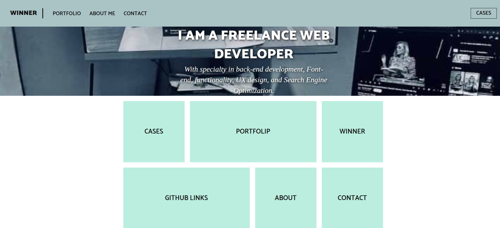
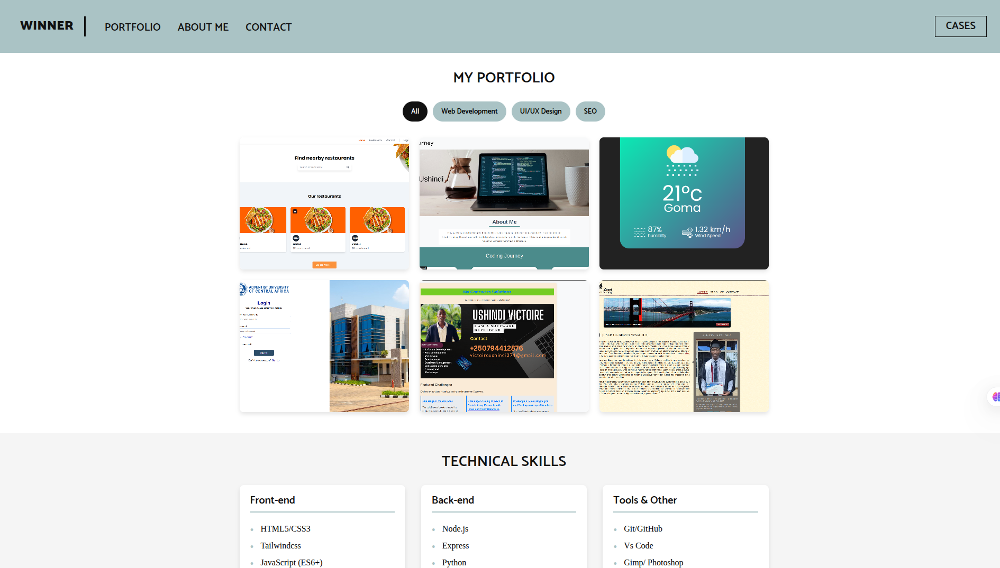

# Victor's Portfolio Website




A modern, responsive portfolio website showcasing my skills as a full-stack web developer with specialization in front-end development, UX design, and SEO optimization.

## 🌟 Features

- **Fully Responsive**: Adapts to all screen sizes (mobile, tablet, desktop)
- **Interactive Elements**: 
  - Animated navigation menu
  - Hover effects on portfolio items
  - Smooth transitions
- **Project Showcase**:
  - Filterable portfolio gallery
  - Detailed case studies
  - Video project demonstrations
- **Modern Design**:
  - Clean, minimalist interface
  - Consistent color scheme (#aac3c5 primary)
  - Custom typography (Catamaran, Cormant Garamond)

## 🛠 Technologies Used

- **Frontend**:
  - HTML5 (semantic markup)
  - CSS3 (Flexbox, Grid, animations)
  - JavaScript (ES6+)
- **Design**:
  - Responsive breakpoints (mobile-first approach)
  - CSS transitions and transforms
  - SVG icons
- **Performance**:
  - Optimized images
  - Minified assets
  - Lazy loading

## 📂 Project Structure
    # Victor's Portfolio Website

 

A modern, responsive portfolio website showcasing my skills as a full-stack web developer with specialization in front-end development, UX design, and SEO optimization.

## 🌟 Features

- **Fully Responsive**: Adapts to all screen sizes (mobile, tablet, desktop)
- **Interactive Elements**: 
  - Animated navigation menu
  - Hover effects on portfolio items
  - Smooth transitions
- **Project Showcase**:
  - Filterable portfolio gallery
  - Detailed case studies
  - Video project demonstrations
- **Modern Design**:
  - Clean, minimalist interface
  - Consistent color scheme (#aac3c5 primary)
  - Custom typography (Catamaran, Cormant Garamond)

## 🛠 Technologies Used

- **Frontend**:
  - HTML5 (semantic markup)
  - CSS3 (Flexbox, Grid, animations)
  - JavaScript (ES6+)
- **Design**:
  - Responsive breakpoints (mobile-first approach)
  - CSS transitions and transforms
  - SVG icons
- **Performance**:
  - Optimized images
  - Minified assets
  - Lazy loading

## 📂 Project Structure
# Victor's Portfolio Website

 <!-- Add a screenshot later -->

A modern, responsive portfolio website showcasing my skills as a full-stack web developer with specialization in front-end development, UX design, and SEO optimization.

## 🌟 Features

- **Fully Responsive**: Adapts to all screen sizes (mobile, tablet, desktop)
- **Interactive Elements**: 
  - Animated navigation menu
  - Hover effects on portfolio items
  - Smooth transitions
- **Project Showcase**:
  - Filterable portfolio gallery
  - Detailed case studies
  - Video project demonstrations
- **Modern Design**:
  - Clean, minimalist interface
  - Consistent color scheme (#aac3c5 primary)
  - Custom typography (Catamaran, Cormant Garamond)

## 🛠 Technologies Used

- **Frontend**:
  - HTML5 (semantic markup)
  - CSS3 (Flexbox, Grid, animations)
  - JavaScript (ES6+)
- **Design**:
  - Responsive breakpoints (mobile-first approach)
  - CSS transitions and transforms
  - SVG icons
- **Performance**:
  - Optimized images
  - Minified assets
  - Lazy loading


## 🚀 Installation & Setup

1. Clone the repository:
   ```bash
   git clone   https://github.com/ub-victor/codealpha_tasks/tree/main/Fontend-Development/Task2
   cd enter in the directory where you save this project
