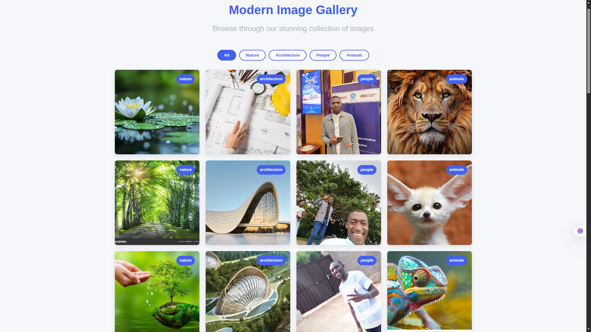
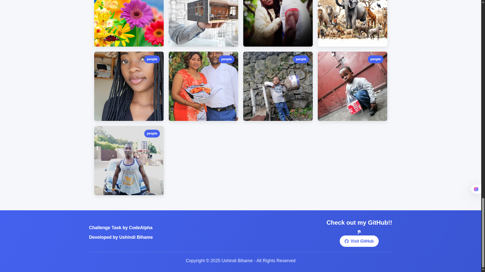

# 📷 Modern Image Gallery Web App

 
 


An interactive, responsive image gallery with filtering and lightbox viewing capabilities, built with HTML, CSS, and JavaScript.

## ✨ Features

- **Category Filtering**: Filter images by nature, architecture, people, or animals
- **Lightbox Viewer**: Click any image for full-screen viewing
- **Responsive Design**: Works perfectly on mobile, tablet, and desktop
- **Smooth Animations**: Hover effects and transition animations
- **Keyboard Navigation**: Use arrow keys and ESC in lightbox mode
- **Modern UI**: Clean, attractive interface with proper spacing

## 🛠️ Technologies Used

- **Frontend**: HTML5, CSS3, JavaScript (ES6)
- **Icons**: Font Awesome
- **Design**: CSS Grid, Flexbox, CSS Variables
- **Responsive**: Mobile-first approach with media queries

## 🚀 Installation & Usage

1. Clone the repository:
```bash
git clone https://github.com/ub-victor/codealpha_tasks/tree/main/Fontend-Development/task3
cd image-gallery