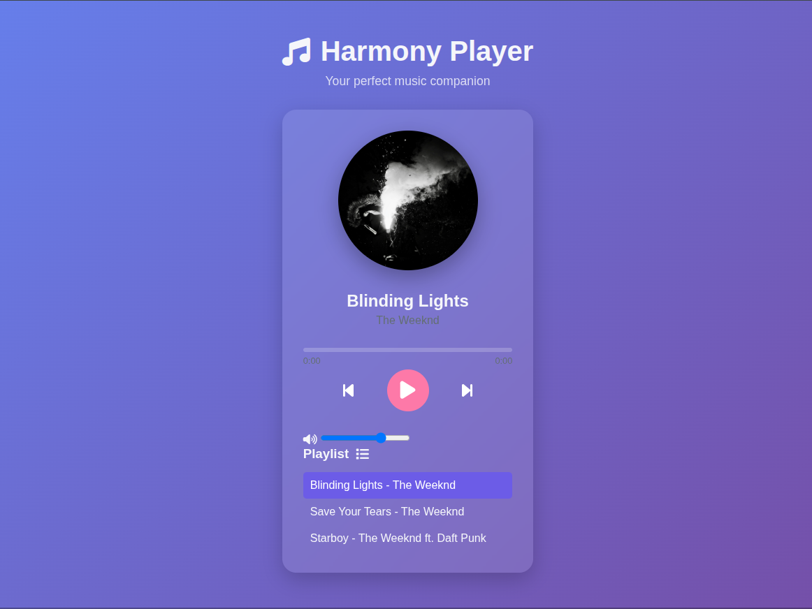

# 🎵 Harmony Music Player




A beautiful, responsive music player with playlist functionality built with HTML, CSS, and JavaScript.

## ✨ Features

- **Play/Pause Controls**: Intuitive playback controls
- **Progress Tracking**: Visual progress bar with time display
- **Volume Control**: Adjustable volume slider
- **Playlist Management**: Browse and select songs from playlist
- **Responsive Design**: Works on all device sizes
- **Visual Feedback**: Album art with vinyl animation
- **Keyboard Controls**: Space for play/pause, arrows for volume

## 🛠️ Technologies Used

- **Frontend**: HTML5, CSS3, JavaScript (ES6)
- **Icons**: Font Awesome
- **Animations**: CSS transitions and keyframes
- **Responsive**: Mobile-first design with media queries

## 🚀 Installation & Usage

1. Clone the repository:
```bash
git clone https://github.com/your-username/music-player.git
cd music-player