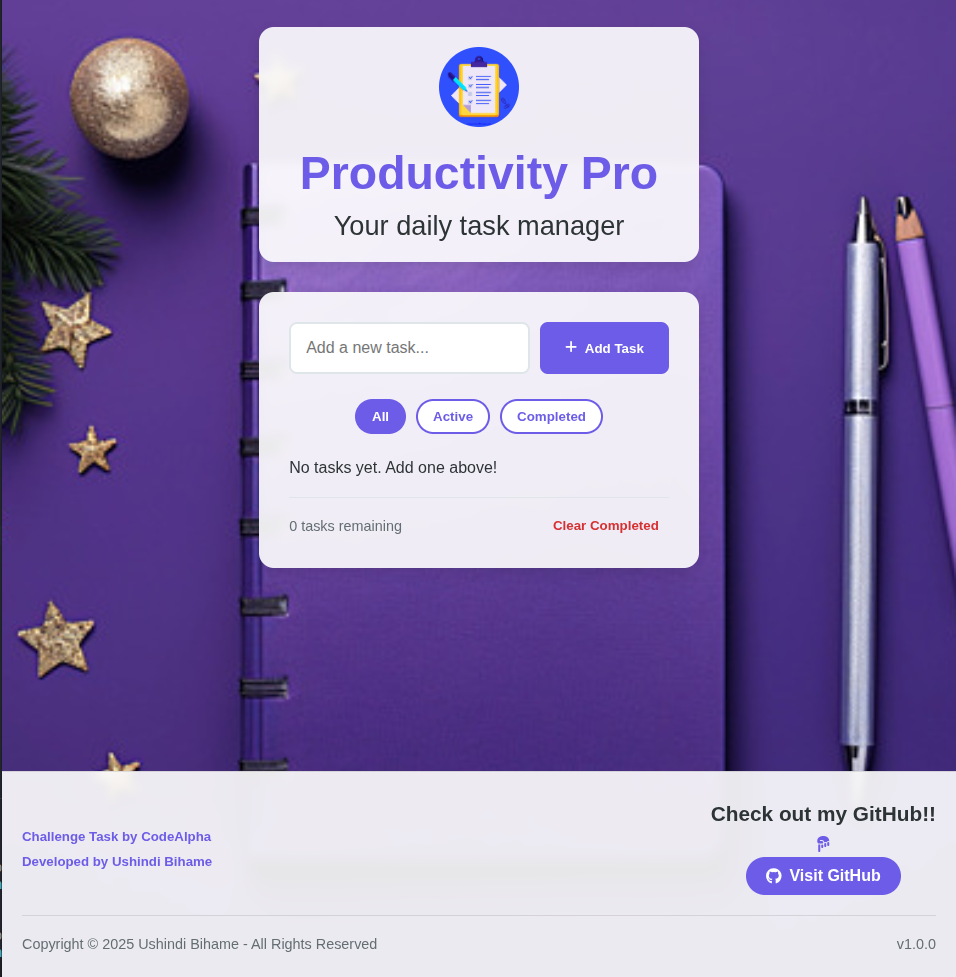

# ✅ Productivity Pro - To-Do List App



A beautiful, responsive to-do list application with task management features.

## ✨ Features

- **Add, edit, and delete tasks**
- **Mark tasks as complete**
- **Filter tasks** (All/Active/Completed)
- **Persistent storage** using localStorage
- **Responsive design** for all devices
- **Task counter** showing active tasks
- **Clean, modern UI** with animations

## 🛠️ Technologies Used

- **Frontend**: HTML5, CSS3, JavaScript (ES6)
- **Storage**: localStorage for data persistence
- **Icons**: Font Awesome
- **Design**: CSS Flexbox/Grid, custom animations

## 🚀 Installation & Usage

1. Clone the repository: 
```bash
git clone https://github.com/your-username/todo-list.git
cd todo-list