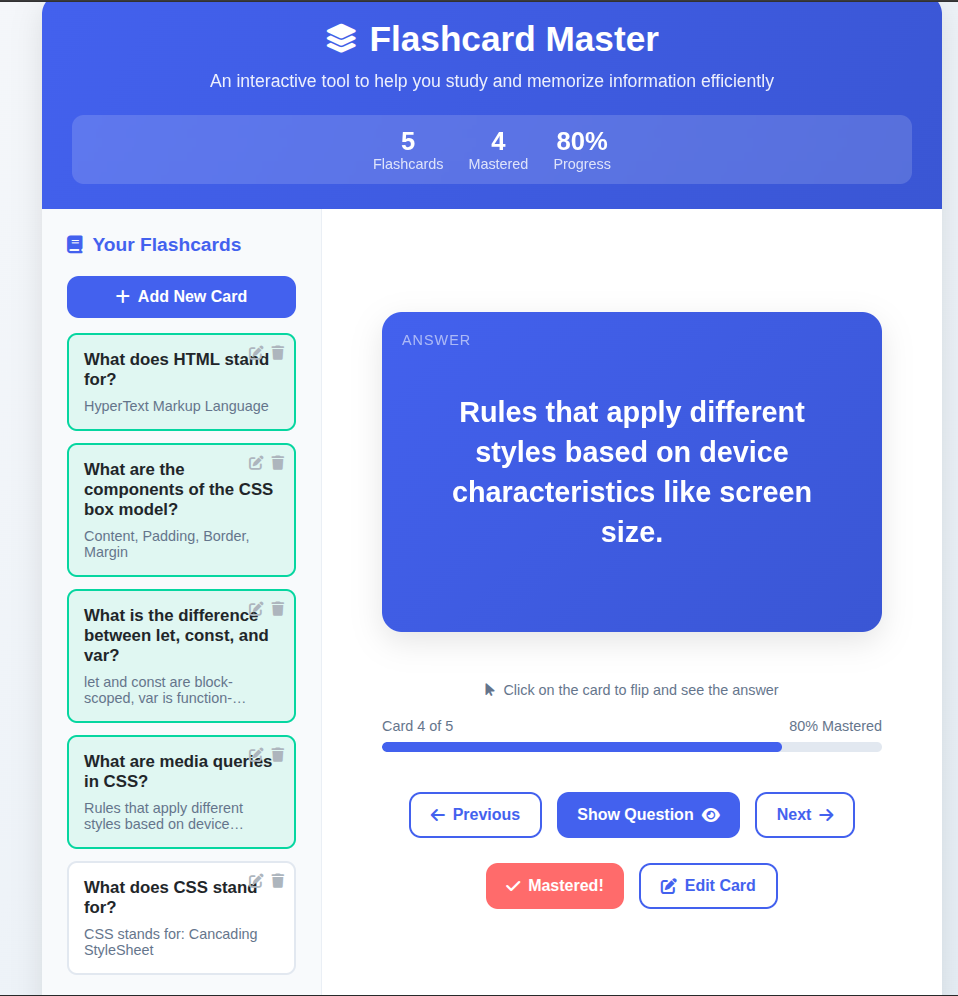
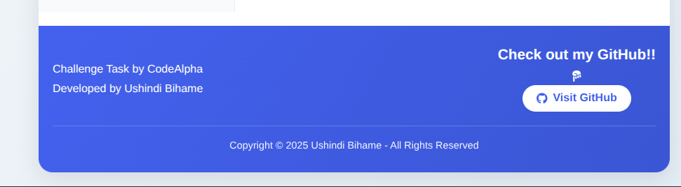

# Flashcard Master - Interactive Learning App





An interactive flashcard application designed to help users study and memorize information efficiently. Features a clean, modern interface with flip animations, card management, and progress tracking.

## Features

✨ **Interactive Flashcards**
- Flip animation to reveal answers
- Visual indicators for mastered cards
- Smooth transitions between cards

📚 **Card Management**
- Add new flashcards
- Edit existing cards
- Delete unwanted cards
- Mark cards as mastered

📊 **Progress Tracking**
- Visual progress bar
- Stats dashboard (total cards, mastered cards, progress percentage)
- Card counter (X of Y)

🎨 **Modern UI**
- Responsive design (works on mobile & desktop)
- Attractive color scheme
- Intuitive navigation
- Animated interactions

## Technologies Used

- **Frontend**: HTML5, CSS3, JavaScript
- **Icons**: Font Awesome
- **Animations**: CSS transitions and transforms
- **Responsive Design**: Media queries and flexible layouts

## Developer
**👨‍💻 Name:** Ushindi Bihame

**📧 Email:** [My Email](victoireushindhi371@123!)

**🔗 GitHub Profile:** [My Github](https://github.com/ub-victor)

**🔗Portfolio Website:** [My Portfolio](https://my-portfolio-website-show-skills.netlify.app/)


```bash
git clone https://github.com/ub-victor/flashcard-app.git
cd flashcard-app
open index.html

